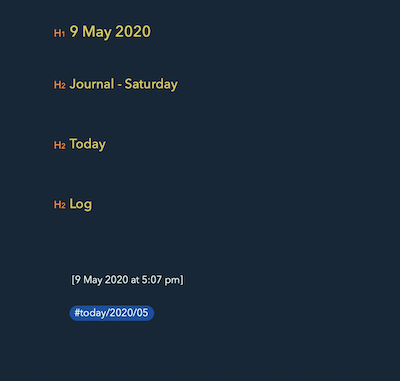

# Bear Today

Bear Today is a templated note generator for [Bear Notes](https://bear.app/) on the Mac.

It allows you to create date based journal or planning entries with date based note titles or tags.




## Getting Started

### 1. Download the latest release.

Download the [latest release](https://github.com/DamianMac/bear-today/releases)

### 2. Unzip it to a handy directory

### 3. Create your first template

Call it `journal.md` and save it in the same directory as BearToday, in a subdirectory called `templates` on in a folder called `~/.beartoday/`

```
---
title: "{{date.day}} {{date.month_name}} {{date.year}}"
tags: ["journal/{{date.year}}/{{date.padded_month}}"]
---
## Journal

## Top Three Things To Do {{date.day_of_week}}


   - [ ] Thing {{ i }}

## Log

```

### 4. Run it

From Terminal, run `./BearToday journal` and open Bear. You'll find a new note named and tagged with today's date.


The templating is based on the [Liquid](https://shopify.github.io/liquid/) language, so go there to find out more about what you can do.  

A full list of properties you can use in your template:

```
date.day_of_week
date.day
date.month
date.year

date.month_name

date.padded_day
date.padded_month
```

## Future Plans

Some of the ideas I have for this 
1. Additional properties for templates.
1. Macros for things like your daily calendar entries
1. Supporting Agenda
1. Output to file or clipboard
1. Open to suggestions!

Any feedback, drop me an email at damian@damianm.com or open an issue.


